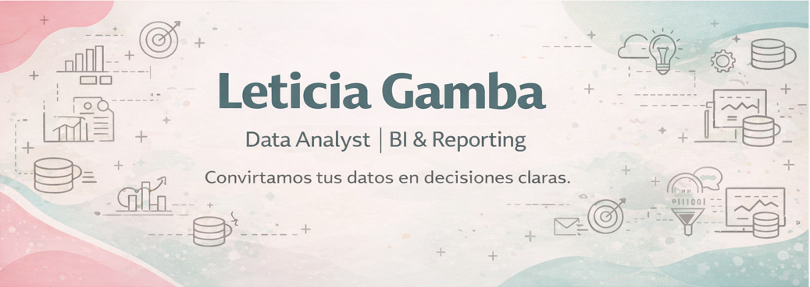

<!-- Banner -->

  

# 📊 Data Analyst | BI & Reporting  
### Power BI • SQL • Python • GIS

---

## ✨ Sobre mí
Convierto datos en **decisiones claras y accionables**.

Trabajo en una gerencia que articula **4 empresas del Grupo CONCI** 🐄  (concesionario **John Deere**, Agroinsumos y Semillas, Riego y Ganadería), integrando **datos comerciales, operativos y territoriales** para entender el negocio de punta a punta.

Cuento con experiencia en **Business Intelligence, automatización y análisis territorial**, aplicando **GIS y herramientas ArcGIS** en el rubro **Agro**, utilizando **NDVI** para estimar **biopotencial de clientes**, zonas productivas y oportunidades comerciales.

---

## 🧠 Tech Stack

### 📊 BI / Analytics

### 🗺️ GIS / Análisis territorial (Agro)

### ☁️ Data / Microsoft

### 💻 Desarrollo

---

## 🕒 Experiencia

**Data Analyst | BI & Data — Grupo CONCI**  
_Jun 2023 – Actualidad_  
- Desarrollo de tableros BI para áreas comerciales, operativas y dirección  
- Definición, estandarización y documentación de KPIs  
- Migración del entorno de datos a **Microsoft Fabric**  
- Integración de múltiples fuentes (ERP, APIs, CRM)  
- Automatización de procesos y reporting  
- Análisis territorial con GIS aplicado al negocio agro  

**Analista de Datos – Marketing — CONCI**  
_Oct 2021 – Jun 2023_  
- Implementación y adopción de CRM  
- Segmentación de clientes y leads  
- Procesos ETL y mantenimiento de bases  
- Reporting y KPIs para marcas (John Deere, Syngenta, Nidera – Red.IN)  
- Soporte territorial y análisis de cobertura comercial  
---

## 🚀 Impactos destacados
📊 **14 tableros BI** implementados en 1 año  
📈 **+250 KPIs** comerciales, operativos y estratégicos  
🧾 Migración de reportes de Excel a **modelos BI automatizados**  
🗂️ Digitalización de procesos (papel → operación 100% digital)  
⛽ Optimización operativa mediante control automatizado de consumo  
🐄 Seguimiento productivo en tiempo real (pariciones, stock, trazabilidad)  
🗺️ Análisis territorial con **GIS / NDVI** para estimar **biopotencial agro**  
🤝 Integración de datos entre empresas para **cross-selling y gestión de cartera**

---

## 🧩 Portfolio 

### ⛽ Control de combustible (BI Operativo)  
- **Problema:** consumo sin trazabilidad  
- **Solución:** modelo BI + dashboard automatizado  
- **Resultado:** control diario y detección de desvíos  
👉 [Ver proyecto](./fuel-control)

### 🐄 Feedlot – seguimiento productivo en tiempo real  
- **Problema:** registros manuales y tardíos  
- **Solución:** captura digital + KPIs  
- **Resultado:** decisiones operativas ágiles  
👉 [Ver proyecto](./feedlot)

### 🗺️ Análisis territorial y biopotencial (GIS + Agro)  
- **Problema:** falta de visibilidad del potencial productivo por zona  
- **Solución:** ArcGIS + NDVI + datos comerciales  
- **Resultado:** priorización de clientes y zonas productivas  
👉 [Ver proyecto](./gis-biopotencial)

### 🧱 Data Lake en Microsoft Fabric  
- **Problema:** datos dispersos en múltiples sistemas  
- **Solución:** ingesta, normalización y gobierno del dato  
- **Resultado:** fuente única para análisis y reporting  
👉 [Ver proyecto](./data-lake)
---
## 🎓 Formación y certificaciones
- **Coderhouse:** SQL (2024), Python (2024), Looker Studio + GA4 (2023),  
  Data Analytics (2021), Power BI (2021), Excel (2021)
- **Universidad Nacional de Córdoba / Mundos E:**  
  Diplomatura en Marketing Digital (2020), Líder Coach (2019)

---

## 🌍 Idiomas
🇬🇧 Inglés: intermedio  
🇫🇷 Francés: básico (en curso)

---

## 📄 CV
➡️ [Descargar CV en PDF](./cv/Leticia_Gamba_CV.pdf.pdf)

---

## 📍 Contacto
📌 **Ubicación:** Córdoba, Argentina  
🔗 **LinkedIn:** https://www.linkedin.com/in/lety-gamba  
✉️ **Email:** lettysgamba1910@gmail.com
